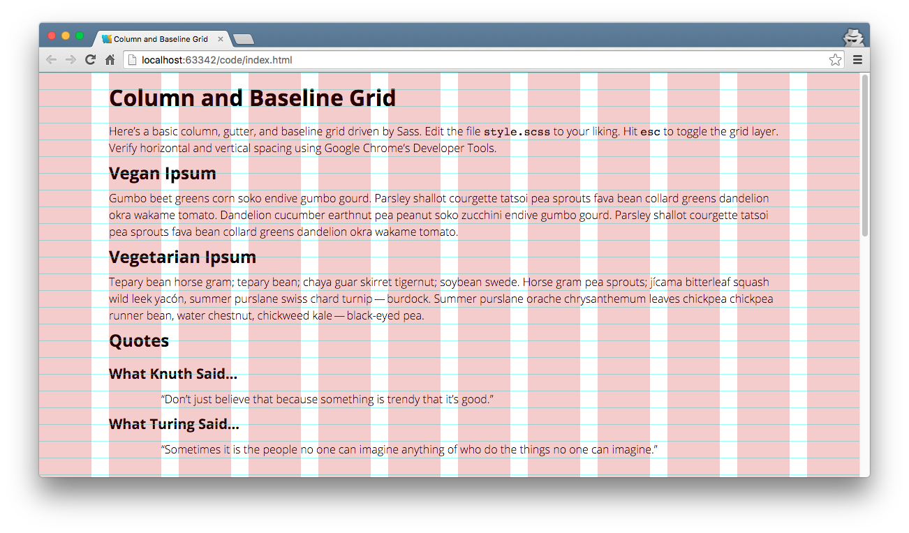

# Column and Baseline Grid

;

This is a simple column and baseline grid that uses 75-pixel columns, 25-pixel gutters, and 24-pixel baselines, each of which can be changed in the file `_variables.scss`. Hitting the `esc` key toggles the grid.

## Installation

Compile the CSS, running the following command from the root folder of this project:

        sass --unix-newlines --sourcemap=none --style compressed sass/style.scss:css/style.css

Add the `watch` flag when you’re working with any of the Sass files:

        sass --unix-newlines --sourcemap=none --style compressed --watch sass/style.scss:css/style.css

## Credits

The [`_reset.scss`](http://960.gs/) file (modified somewhat) is culled from the grid package provided by `http://www.960.gs`. The simple grid syntax in `_grid.scss` is a modification of CodePen user Arvin Quilao’s [example](http://codepen.io/arvinquilao/pen/IbwaA), which, in turn, is derived from GitHub user MikeAM’s [Gist example](https://gist.github.com/MikeAM/5171527#file-baseline-grid-css).

The font used in this example is [Open Sans](https://www.google.com/fonts#UsePlace:use/Collection:Open+Sans), licensed under the [SIF OFL](http://scripts.sil.org/cms/scripts/page.php?item_id=OFL_web).

Ipsum context extracted from [Vegan Ipsum](http://bengreen.org.uk/veganipsum/), [Veggie Ipsum](http://veggieipsum.com/), and [Pet Lover Lorem Ipsum] (http://eneemenee.com/).

— Roy Vanegas
