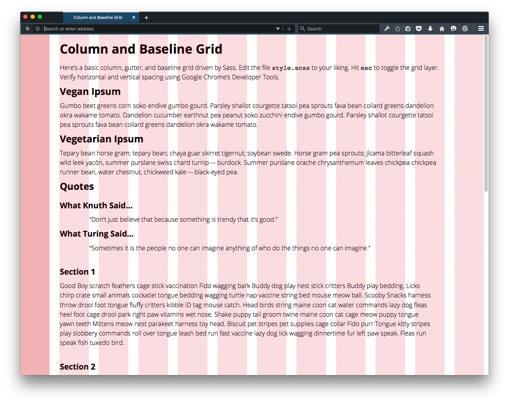
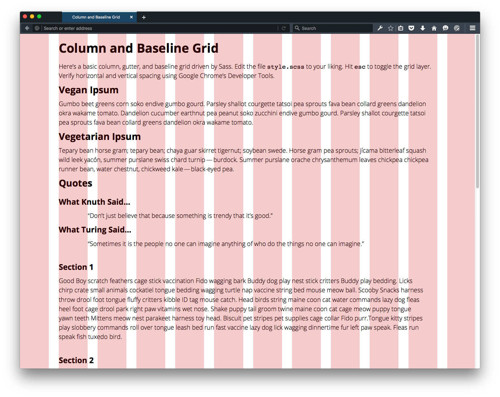
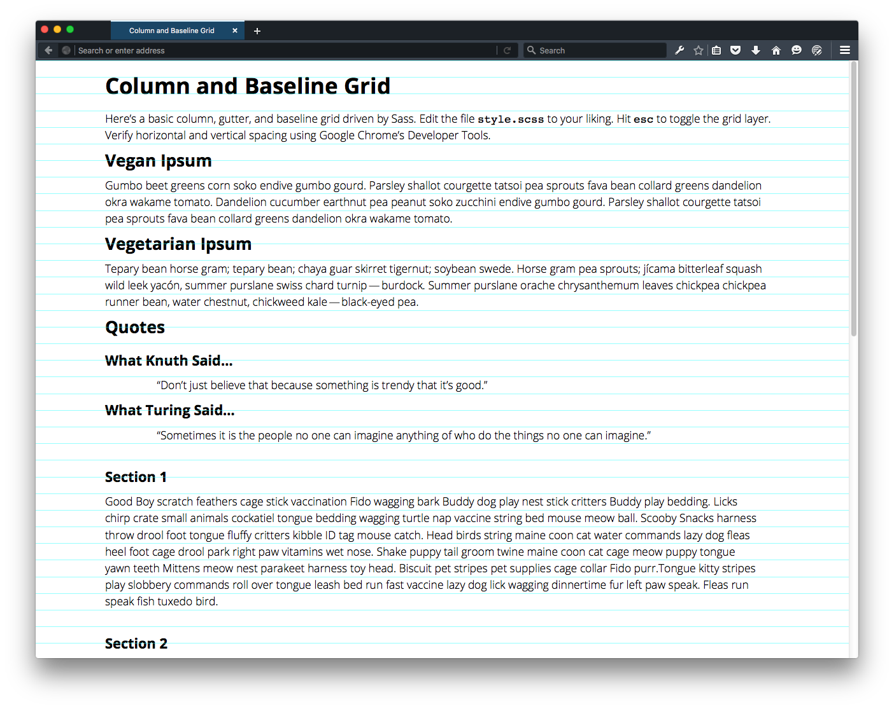
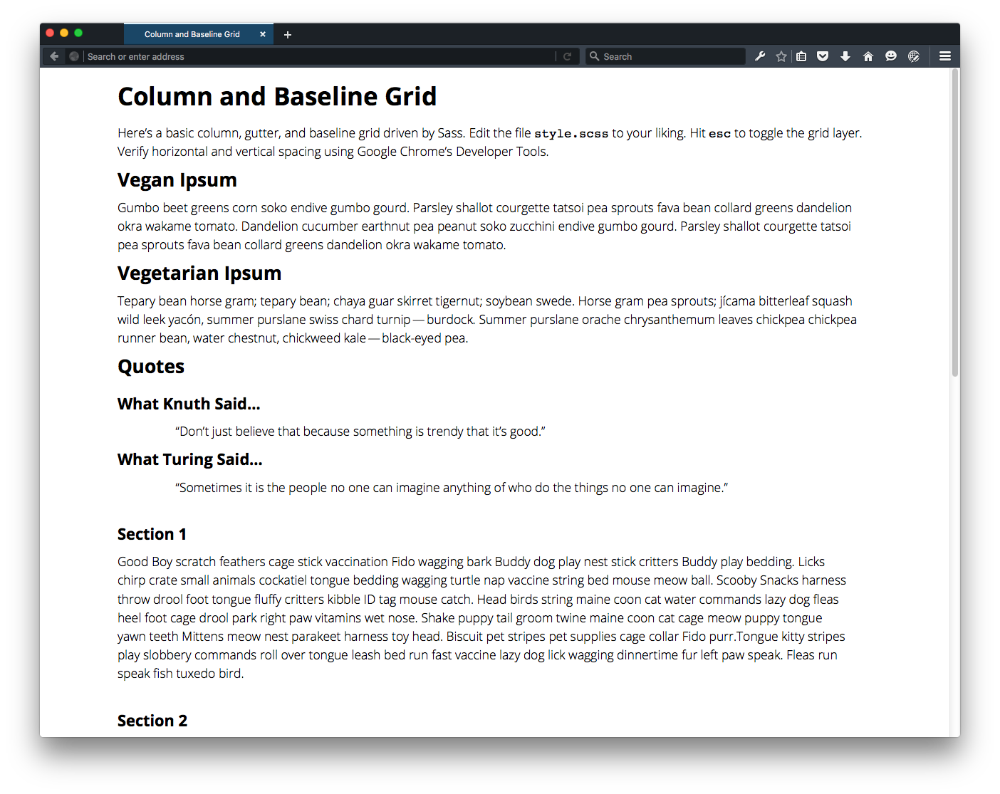

# Column and Baseline Modular Grid
(v1.0.3)

This is a simple column and baseline grid (known as a modular grid) that uses **75-pixel columns**, **25-pixel gutters**, and **24-pixel baselines** in order to compare against a user-supplied image. Hitting the `esc` key toggles the grid in a round-robin fashion, observing the following order.

1. Displays *only* the user-supplied image (used for comparison) and your HTML.
2. Displays *only* the column and baseline modular grid and your HTML.
3. Displays *only* the column grid and your HTML.
4. Displays *only* the baseline grid and your HTML.
5. Displays *none* of the grids and *only* your HTML.

See the screenshots below.

## Installation

Compile the CSS by running the following Sass command from the root folder of this project:

        sass --unix-newlines --sourcemap=none --style compressed --watch sass/style.scss:css/style.css

## Usage

1. Adjust your browser window to the left so the darker pink column is aligned according to the first screenshot in this `README`.
2. Toggle the grids by hitting the `esc` key.

## Use In Your Own Project

To modify this project for your own purposes, you’ll need to

1. Add to the `img` folder the image you want to use to compare against the modular grid.
2. Update the background image path (currently `../img/modular-grid.png`) on line 9 of `_variables.scss` to the image you added in step 1.
3. Adjust the variables in the file `_variables.scss` to create your own grid.
4. Adjust your browser window to the left so the grids line up.

**Note**: The remaining images in the `img` folder are the screenshots used in this `README` file. They may be deleted.

## Credits

The [`_reset.scss`](http://960.gs/) file (modified somewhat) is culled from the grid package provided by `http://www.960.gs`. The simple grid syntax in `_grid.scss` is a modification of CodePen user Arvin Quilao’s [example](http://codepen.io/arvinquilao/pen/IbwaA), which, in turn, is derived from GitHub user MikeAM’s [Gist example](https://gist.github.com/MikeAM/5171527#file-baseline-grid-css).

The font used in this example is [Open Sans](https://www.google.com/fonts#UsePlace:use/Collection:Open+Sans), licensed under the [SIF OFL](http://scripts.sil.org/cms/scripts/page.php?item_id=OFL_web).

Ipsum context extracted from [Vegan Ipsum](http://bengreen.org.uk/veganipsum/), [Veggie Ipsum](http://veggieipsum.com/), and [Pet Lover Lorem Ipsum] (http://eneemenee.com/).

— Roy Vanegas
