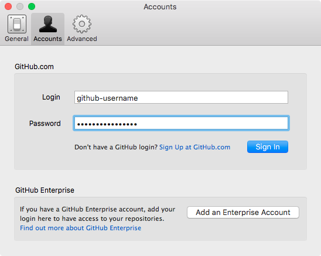
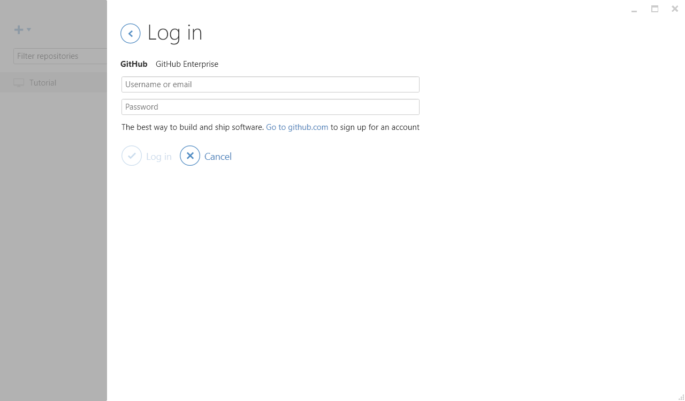

# Modular Grid Chrome Extension
(v1.0.0)

This extension provides a grid overlay to web pages in order for web authors to see how pages in development compare against the grid used in design. Some key options include the ability for the user to change column colors and opacity, column widths, gutter widths, and baseline/leading distance. The grid’s `options` page shows more, and feature requests are encouraged via GitHub issues.


## Beta Release Date
29 January 2017

## Installing the Beta
Installing this extension requires downloading a folder and “feeding” it to Chrome. I’ll discuss how to do this through the GitHub Desktop client and via a command line interface.

### GitHub Desktop Installation
(Burden: ~5 minutes)

1. Launch GitHub Desktop.
2. Log in via the `Preferences…` page in Mac or the `Options…` page in Windows

      

      

3. Load the repo into GitHub Desktop by clicking the appropriate link for your operating system.

   **Mac**: [`github-mac://openRepo/https://github.com/code-warrior/column-baseline-grid`](github-mac://openRepo/https://github.com/code-warrior/column-baseline-grid)

   **Windows**: [`github-windows://openRepo/https://github.com/code-warrior/column-baseline-grid`](github-windows://openRepo/https://github.com/code-warrior/column-baseline-grid)

4. Choose a name and location for the repo, then click the blue `Clone` button.

      

5. You should see something akin to the following:

      

6. Open Chrome’s extensions page by typing [`chrome://extensions`](chrome://extensions) into the address bar, then open the folder into which you cloned the `column-baseline-grid` repo. In my case, it’s a folder called `GitHub`.

      

7. Drag the `column-baseline-grid` folder over the extensions page.
8. The extension is now installed. (The title **column-baseline-grid** is a legacy artifact that will likely be changed to **The Modular Grid**.)

      

### Command Line Interface (CLI) Installation
(Burden: ~2 minutes)

1. Launch your CLI and navigate to a folder into which to download the extension.
2. Clone the repository:

        git clone git@github.com:code-warrior/column-baseline-grid.git

3. Switch to the version 1.0.0., release candidate 1 branch:

        git checkout ver1.0.0-rc1

4. Launch Chrome.
5. Type `chrome://extensions` into the address bar.
6. Locate the `column-baseline-grid` folder that was created when you cloned this project in step `2`.
7. Drag the folder over the `Chrome Extensions` window.
8. A greyish, grid-like icon should now appear to the right of the address bar. Click it to toggle the grid on/off.

### Updates
Once the project is stable, it will be released via the Chrome Web Store. In the meantime, you can pull updates periodically. In your CLI, simply `git pull`, and in the GitHub Desktop client, click the `Sync` icon in the upper right hand corner.

### Keyboard Shortcuts
`Ctrl+Shift` enables/disables the sidebar info boxes in the upper right hand corner. This shortcut is universal across all operating systems.

`Command+Shift+A` enables/disables the extension in Mac.

`Ctrl+Shift+A` enables/disables the extension in Windows 10.

`Ctrl+Shift+A` enables/disables the extension in Fedora Linux.

## Development

### Compiling

#### Sass
````bash
\sass \
   --sourcemap=none \
   --unix-newlines \
   --no-cache \
   --style compressed \
   --watch content/main.scss:content/main.css \
      options/main.scss:options/main.css
````

### Linting

#### Sass
````bash
sass-lint -c .sass-lint.yml -v -s .
````
